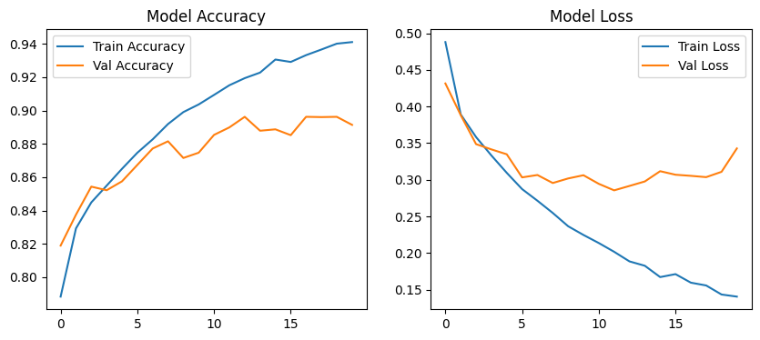

# Gait Classification Using 1D CNN (Daphnet Freezing of Gait Dataset)

This project implements a 1D Convolutional Neural Network (CNN)
to classify gait patterns and detect Freezing of Gait (FOG) episodes 
using wearable inertial sensor data from the Daphnet Freezing of Gait Dataset.
The model processes raw accelerometer data, segments it into fixed windows, and classifies
gait into three states: 0 – Normal Walking, 1 – Pre-Freezing, and 2 – Freezing of Gait (FOG).

# Dataset Information

The dataset contains tri-axial accelerometer signals recorded from
Left Leg (LL), Right Leg (RL), and Waist (WA) sensors at a sampling rate of 100 Hz.
Each .txt file includes a timestamp, 9 accelerometer features 
(LL_x, LL_y, LL_z, RL_x, RL_y, RL_z, WA_x, WA_y, WA_z), and a gait label.
After merging all files, the dataset shape becomes (1917887, 11).

# Dataset Download Instructions
The Daphnet Freezing of Gait Dataset is not included in this repository due to size restrictions.
Download it from the official source:
**Dataset Link**:
(https://archive.ics.uci.edu/dataset/245/daphnet+freezing+of+gait)

After downloading:
Extract the dataset
Copy all .txt files into the /data folder (create it if it doesn't exist)

# Data Processing

All sensor files were combined, numeric features extracted, and values normalized
using StandardScaler. The time-series data was segmented into windows of 128 samples
with 50% overlap, producing input samples of shape (29965, 128, 9) suitable for CNN training.

# Model Architecture

A 1D CNN model was built consisting of:
Conv1D (64 filters) → MaxPooling → Dropout → Conv1D (128 filters) → MaxPooling → Flatten → Dense(128) → Dropout → Dense(3, Softmax).
The network contains 518,531 trainable parameters.

# Training & Evaluation

The model was trained for 20 epochs using Adam optimizer and sparse categorical 
crossentropy loss. Results show stable performance across runs with:
Test Accuracy: ~89–90%
Test Loss: ~0.31–0.34
# Model Accuracy

This plot shows the training and validation accuracy of the 1D CNN model.

# Future Applications

This model can support real-world healthcare solutions including Parkinson’s disease monitoring,
early detection of gait abnormalities, real-time FOG detection on wearable devices,
fall-risk prediction, smart home alert systems, and rehabilitation tracking.
It also provides a strong baseline for clinical research using deep learning for
neurological gait analysis.

# Summary

This project demonstrates that 1D CNNs can effectively classify gait patterns
from wearable accelerometer data, making it a valuable contribution toward medical AI,
Parkinson’s research, and intelligent patient monitoring systems.
